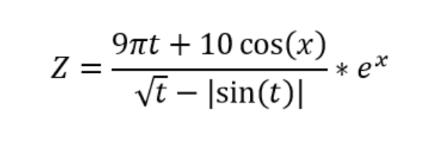

# Практичне завдання 1
1. Змінній `var_int` надайте значення 10, `var_float` - значення 8.4, `var_str` - "No".
2. Змініть значення, збережене в змінної `var_int`, збільшивши його в 3.5 рази, результат зв'яжіть зі змінною `var_big`.
3. Змініть значення, збережене в змінної `var_float`, зменшивши його на одиницю, результат зв'яжіть з тієї ж змінної.
4. Розділіть `var_int` на `var_float`, а потім `var_big` на `var_float`. 5.Результат даних виразів не прив'язуйте до жодних змінних.
6. Виведіть значення всіх змінних.
7. Напишіть програму, яка запитувала б у користувача: 
    - ПІБ ("Ваші прізвище, ім'я, по батькові?")
    - вік ("Скільки Вам років?")
    - місце проживання ("Де Ви живете?")
    - де Ви навчаєтесь (“Де Ви навчаєтесь?”)
    - номер Вашої групи( “Номер Вашої групи?”)
    - порядковий номер по списку у группі(“Який Ваш порядковий номер у списку групи?”)
    - питання відповідно до варіанту

    Після цього виводила б рядки:
    - "Ваше ім'я"
    - "Ваш вік"
    - "Ви живете в"
    - “Ви навчаєтесь в”.
    - “Номер моєї групи -”
    - “Мій порядковий номер у списку групи-“ «Ваш варіант відповіді»

No Варіанту - остання цифра у списку групи. 

| No Варіанту | Питання |
|---|---|
| 0 | Як справи? |
| 1 | Як Ви себе почуваєте? |
| 2 | Коли будете вдома? |
| 3 | Яку оцінку отримав на ЗНО по українській мові? |
| 4 | Сьогодні сонячно? |
| 5 | Коли нарешті карантин? |
| 6 | Як звати Вашого друга? |
| 7 | Ви думаєте вступати у магістратуру? |
| 8 | Якого кольору Ваш зошит? |
| 9 | Який Ваш настрій сьогодні? |

8. Написати програму для розрахунку Z

    - Для введення даних використовуйте команду input, визначивши тип змінних.
    - Результат вивести з двома знаками після коми. х - остання цифра у списку групи, t=1.
